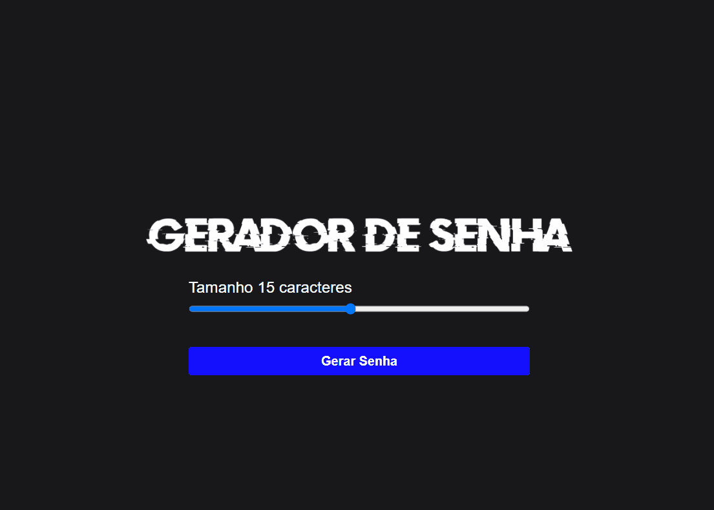

# geradorDeSenha

Um Site que permite a criação de senhas aleatórias. Sendo assim, o usuário não vai esquentar a cabeça pensando : "Como criar uma senha forte de 15 caracteres ?" 

<h1>Hospedagem</h1>

Veja o código funcionando em Tempo Real : 

geradorsenha-s.netlify.app

<h1>Tecnologias</h1>

<ul>
    <li>HTML</li>
    <li>CSS</li>
    <li>JavaScript</li>
</ul>
